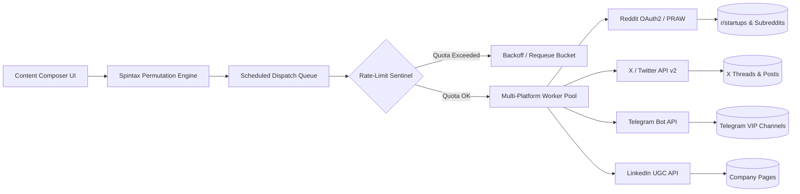

# OmniPost Studio | Multi-Platform Social Content Engine & Queue

> **Internal Enterprise System**  
> Commissioned & deployed for **Kinetic Media Group Inc.**  
> **Live Web Portal:** [https://rika812.github.io/omnipost-studio/](https://rika812.github.io/omnipost-studio/)

---

## System Overview

**OmniPost Studio** is a centralized social content orchestration suite designed to schedule, permute, and dispatch marketing publications across Reddit subreddits, X / Twitter profiles, Telegram broadcast channels, and LinkedIn pages from a single command interface.

### Key Architecture



---

## Core Capabilities

1. **Spintax Anti-Shadowban Engine**
   - Automatically parses `{Variant A|Variant B|Variant C}` syntax patterns into randomized permutations, eliminating duplicate copy flags across high-volume marketing campaigns.

2. **Per-Channel Rate-Limit Sentinel**
   - Tracks platform-specific API call quotas (e.g. 60 req/min on Reddit, 50 req/min on X) and automatically applies exponential backoff when throttling thresholds are approached.

3. **Multi-Channel Dispatching**
   - Asynchronous distribution across Reddit subreddits, Twitter threads, Telegram channels, and LinkedIn business pages.

4. **Telemetry & Engagement Analytics**
   - Live tracking of aggregated impressions, engagement velocity curves (via Chart.js), and historical HTTP 200 audit logging.

---

## Project Structure

```text
omnipost-studio/
├── index.html             # High-performance scheduling & analytics dashboard
├── social_scheduler.py    # Python background scheduler & spintax worker engine
├── requirements.txt       # Project dependencies
└── README.md              # Infrastructure and deployment documentation
```

---

## Quickstart & Simulation

### 1. Prerequisites
- Python 3.10+ installed
- Virtual environment recommended

### 2. Installation
```bash
git clone https://github.com/rika812/omnipost-studio.git
cd omnipost-studio
pip install -r requirements.txt
```

### 3. Run Scheduler Simulator
```bash
python social_scheduler.py
```

---

## Production Security & Compliance Notice

This repository contains client-ordered operational infrastructure. Production social tokens, OAuth2 client secrets, and private webhook endpoints are stored securely in environment secret vaults and are omitted from public version control.

*Authorized personnel only. (c) 2026 Kinetic Media Group Inc.*
